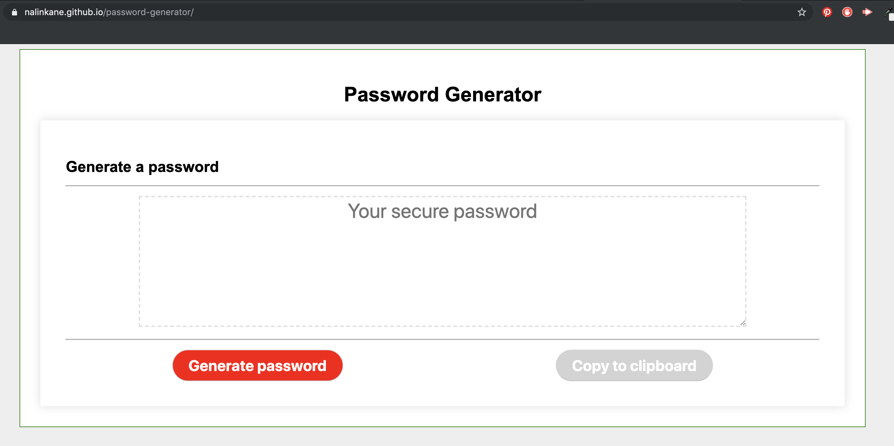

# Random password generator

This project is a random password generator, accessible via [this link](https://nalinkane.github.io/password-generator/).

## Here's what it looks like

## Here is how it works

Once clicked, the "Generate password" button prompts the user to input the length of the password (between 8 and 128).

If the user inputs a number smaller than 8 or greater than 128, the program will inform them of their error.

Once the user specifies a number within the correct range, the program will then ask a series of questions on the characters to include/omit when generating the password. The user can choose from lower/upper case letters, special characters (for example, "!", "&", etc.) and numbers. If no characters a chose, the program will throw an error.

Once generated, the password will appear in the text area of the website and can be copied to clipboard by clicking on the grey button.
